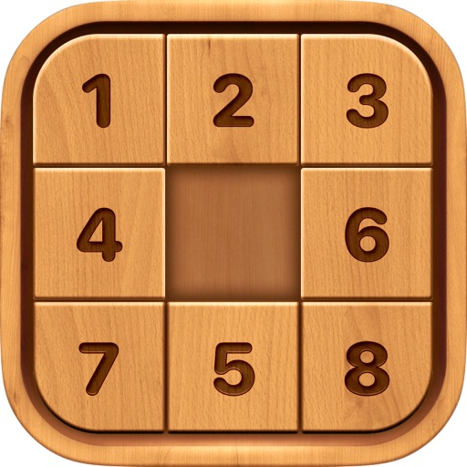

# N-puzzle
**"A" Algorithm** to solve the **N Sliding Puzzle** using **Manhattan Distance**



- All the steps from start to goal are displayed as the output
- Any desired GOAL state may be set
- Half of the starting states are unsolvable (check not incorporated)
- Enhancements = "Manhattan Distance+Linear Conflict" and Pattern Database
- IDA* is required for 15 and higher orders

## How to run?
Use matlab to run:
```
npuzzle.m
```

## IMPORTANT REFERENCES USED
### Paper
Garrido, Angel. "THE 8-PUZZLE PROBLEM (MATRIX THEORY IN AI)."
http://emis.math.tifr.res.in/journals/AUA/acta12/Angel%20Garrido%202/8pAUA.pdf

### Optimal 8/15-Puzzle Solver - Brian Borowski
http://www.brian-borowski.com/Software/Puzzle/
